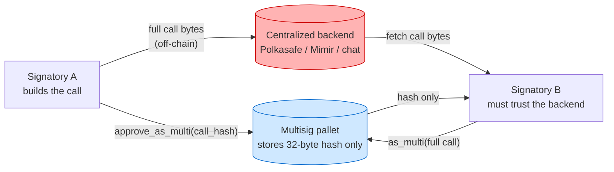
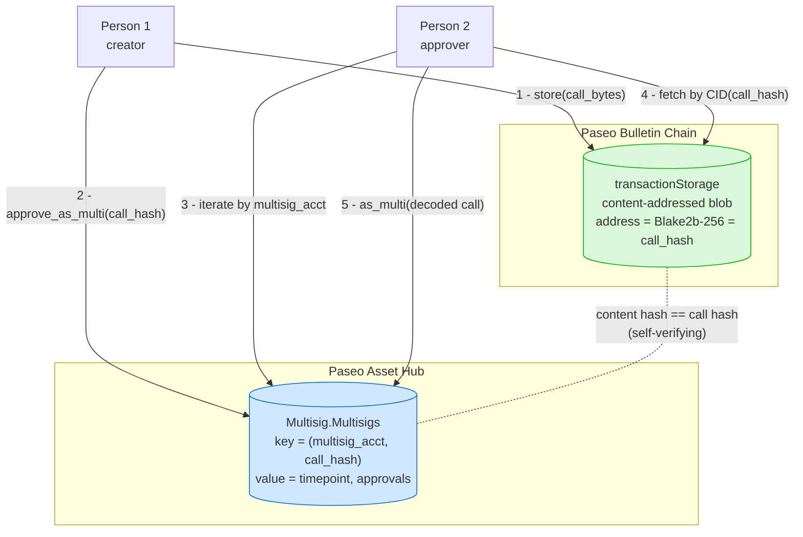
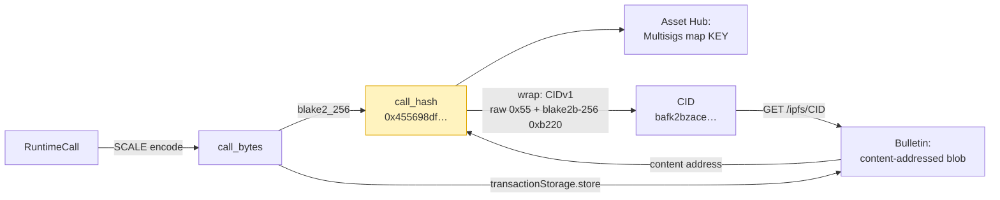
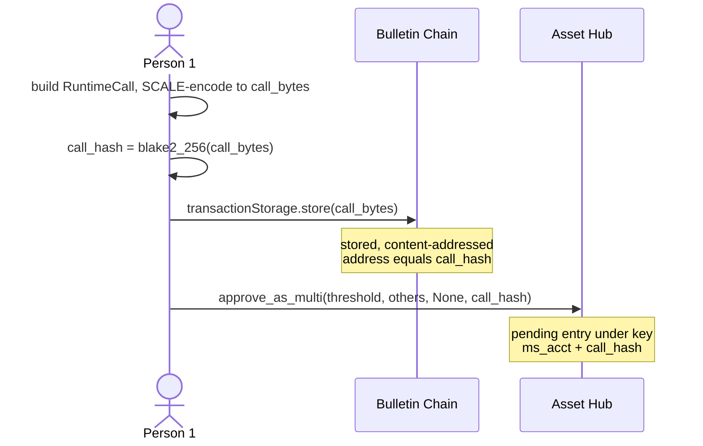
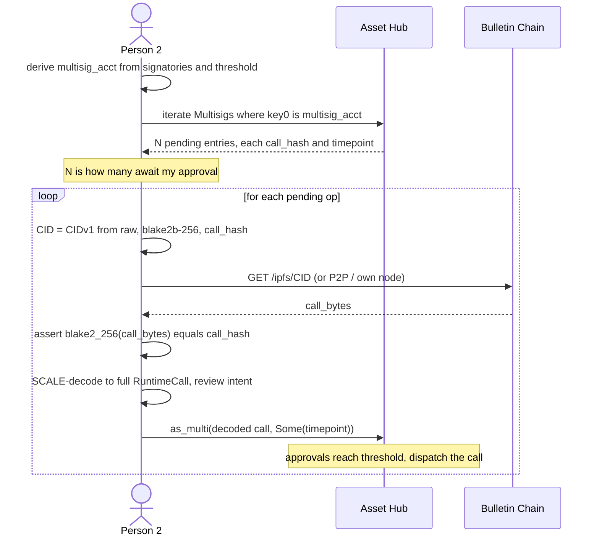
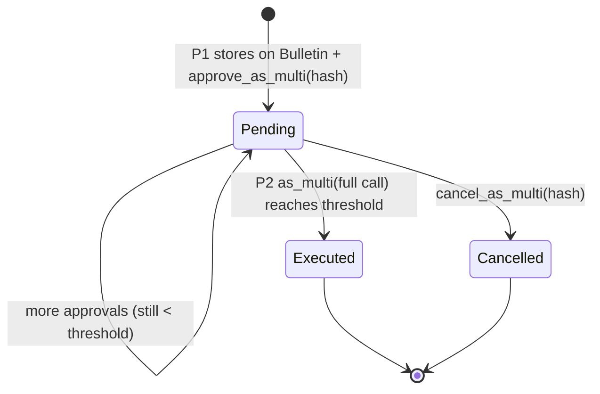
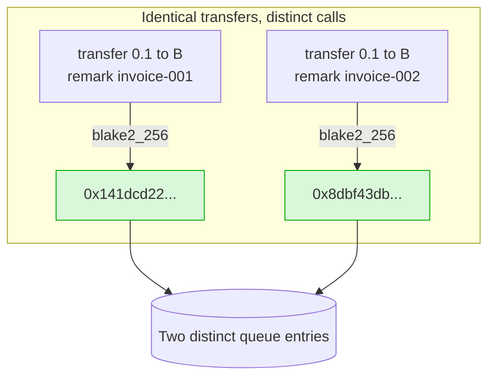

# Decentralizing Polkadot Multisig Call-Data Synchronization with the Bulletin Chain

**A Proof-of-Concept Research Report**
Project: `narada` · POC · 2026-06-19
Verified live on Paseo (Asset Hub + Bulletin "Paseo Next v2")

---

## Abstract

Polkadot's `pallet-multisig` records only a 32-byte **hash** of a pending call on-chain;
the actual **call data** (the bytes describing what the transaction *does*) is never
stored on-chain until the moment of execution. Every co-signer who needs to inspect or
execute that call must therefore obtain the bytes through some **off-chain** channel.
Today this is solved with centralized backends (Polkasafe, Mimir) or manual hex sharing,
which re-introduces a single point of failure and trust into an otherwise trust-minimized
primitive.

This report shows that the **Polkadot Bulletin Chain** — a content-addressed, transient
on-chain storage chain — can carry the multisig call data so that synchronization happens
**on-chain and non-custodially**. The key observation: the multisig's call hash and the
Bulletin's content address are *the same* Blake2b-256 digest, so the on-chain hash doubles
as the storage key with no extra mapping. We implemented the full lifecycle in Rust
(`subxt`) and verified it end-to-end on the public Paseo testnet, including an
"accountant-prepares / management-approves" multi-transaction workflow and a remark-based
scheme for distinguishing economically-identical payments.

---

## 1. Problem Statement

A Polkadot multisig with threshold *t* over *n* signatories works in two phases:

1. **Approval phase** — the first signatory registers the operation with
   `approve_as_multi(call_hash, …)`. The chain stores an entry under
   `Multisig.Multisigs[(multisig_account, call_hash)]` containing the timepoint and the
   set of approvers. **Only the 32-byte `call_hash` is stored — not the call itself.**
2. **Execution phase** — the final signatory must call `as_multi(call, …)` supplying the
   **full** SCALE-encoded call. The pallet recomputes `blake2_256(call)`, matches it to
   the stored hash, and (if approvals ≥ threshold) dispatches it.

The gap: between phases, **someone must transport the full call bytes to every signatory**
who wants to (a) understand what they are approving and (b) execute it. The chain doesn't
help — it only has the hash.



**Consequences of the off-chain backend:**

- **Single point of failure** — if the backend is down, pending multisigs cannot be
  inspected or executed.
- **Custodial trust** — the backend can withhold, alter, or selectively serve call data.
- **Blind-signing risk** — without the call data, a signer sees only a hash and may
  approve something they cannot read.
- **Vendor lock-in** — migrating tools means migrating all in-flight multisig state.

> **Research question:** Can the call data be synchronized **on-chain**, so that any
> signatory can independently and verifiably obtain the full call from public
> infrastructure — with no centralized orchestrator — and never has to blind-sign?

---

## 2. Background — why the hash is not enough

The call hash is, by construction:

```
call_hash = blake2_256( SCALE-encode( outer RuntimeCall ) )
```

It is a *commitment*: it proves which call will run, but reveals nothing about it. A 32-byte
hash cannot be reversed into `transfer 10 DOT to Alice`. So the hash alone lets a signer
verify a call they *already have*, but it cannot *give* them the call. That asymmetry is
the entire reason call-data synchronization exists as a problem.

---

## 3. Proposed Approach

Store the SCALE-encoded call on the **Bulletin Chain** at creation time. The Bulletin
Chain content-addresses data by its **Blake2b-256** digest — which is the *same* hash
function and the *same* input bytes the multisig pallet uses. Therefore:

> **The multisig `call_hash` *is* the Bulletin content address.**

No side database, no hash→location mapping, no index to maintain. Given the on-chain
`call_hash`, anyone can deterministically reconstruct the content identifier (CID) and
fetch the bytes from the Bulletin Chain, then verify them locally against that same hash.



This is **non-custodial**: the call data lives on a public chain, addressed by a hash that
is itself published on a public chain, and verified locally. No party stands between the
signatories.

---

## 4. What we store in the Bulletin Chain (data model)

We store the **exact SCALE-encoded bytes of the outer `RuntimeCall`** — the same bytes the
multisig pallet hashes and the same bytes `as_multi` expects at execution. Nothing is
wrapped, transformed, or annotated; the blob *is* the canonical call encoding.

For a simple payment `balances.transfer_keep_alive(dest, value)` this is ~39 bytes:

```
SCALE-encoded RuntimeCall  (example: transfer_keep_alive, 39 bytes)
┌─────────────┬───────────┬──────────────────────────────┬────────────────┐
│ pallet idx  │ call idx  │ dest: MultiAddress::Id        │ value: Compact │
│  (1 byte)   │ (1 byte)  │  0x00 + AccountId32 (1+32 B)  │  <u128>        │
└─────────────┴───────────┴──────────────────────────────┴────────────────┘
        └───────────────────────── blake2_256 ─────────────────────────────┘
                                       │
                                       ▼
                          call_hash  (32 bytes, e.g. 0x455698df…)
```

The single 32-byte digest is reused three ways — this is the linchpin of the design:



**CID construction** (deterministic, offline):

```
CIDv1 = <version 0x01> <codec raw 0x55> <multihash: blake2b-256 0xb220, len 0x20, digest>
hex   = 0x 01 55 a0e402 20 <32-byte call_hash>
text  = bafk2bzace…   (multibase base32)
```

Because `transactionStorage.store` defaults to `Blake2b256` hashing + the `raw` codec, and
the call is a single small block (no UnixFS/DAG-PB wrapping), the content digest equals
`blake2_256(call_bytes)` exactly — i.e. the multisig `call_hash`.

---

## 5. Protocol walkthrough

### 5.1 Person 1 — creating a transaction so Person 2 can fully retrieve it

The creator does **two** on-chain writes — one per chain — and shares **nothing** off-chain:



After this, the full call is **publicly retrievable** (Bulletin) and the pending operation
is **publicly listed** (Asset Hub) — both addressed by the same `call_hash`. Person 1 can
go offline; nothing else is needed from them.

### 5.2 Person 2 — discovering how many approvals are pending, and signing

Person 2 only needs the **multisig membership** (public config: the signatory set +
threshold), from which the multisig account is deterministically derived
(`blake2_256("modlpy/utilisuba" ++ sorted(signatories) ++ threshold)`). With that, they
**iterate** the on-chain `Multisig.Multisigs` map keyed by the multisig account — every
entry under that key is a pending operation awaiting their approval. **The count of those
entries is the number of pending transactions.** Nothing is handed to them.



The decode step uses the chain's own type registry (metadata), so Person 2 reconstructs the
**entire** call tree and signs the *decoded* call — never an opaque hash. A call that fails
to decode is also one that cannot execute, so "don't sign what won't decode" never blocks a
legitimate payment.

### 5.3 Multisig operation lifecycle



---

## 6. Handling economically-identical payments (the invoice problem)

Because the queue is keyed by `call_hash`, two payments that are byte-identical — *same
payee, same amount* — produce the **same** hash and collide: the pallet rejects the second
`approve_as_multi(None)` with `Multisig::NoTimepoint`. But in accounting these are often
**different** transactions (e.g. paying two invoices to the same vendor).

**Solution:** make the call distinct without changing the transfer, by wrapping it with an
audit reference:

```
batch_all([ transfer_keep_alive(payee, amount),
            system.remark_with_event(<invoice ref>) ])
```

The remark bytes change the SCALE encoding → distinct `call_hash` per invoice, while the
transfer is identical. The remark is also an **on-chain audit reference** (it emits a
`System.Remarked` event), and because the whole batch is on Bulletin, the reviewer sees the
invoice decoded in the pending list.



---

## 7. Implementation

A standalone Rust binary (`subxt` 0.50), isolated from the main app. Two chain clients,
one IPFS gateway, no backend.

| Layer | Choice |
|---|---|
| Multisig + balances | **Paseo Asset Hub** (post-Asset-Hub-Migration home of these pallets) |
| Call-data storage | **Paseo Bulletin Chain "Next v2"** (`transactionStorage`) |
| Retrieval | Bulletin IPFS gateway `…/ipfs/<CID>?format=raw` (P2P-capable) |
| Hashing | `blake2_256` (Blake2b, 32-byte digest) — identical on both chains |
| CID | `cid` 0.11 — CIDv1, raw codec `0x55`, multihash blake2b-256 `0xb220` |
| Call encode/decode | subxt `call_data()` (encode) + `DecodeAsType` over runtime metadata (decode) |

**Commands**

| Command | Actor | Role |
|---|---|---|
| `address` | — | derive + print the multisig account |
| `fund-multisig` | — | seed the multisig account with PAS |
| `init [--recipient --amount --memo]` | Person 1 | store on Bulletin + `approve_as_multi` |
| `pending` | reviewer | list queued ops, **decoded from Bulletin** |
| `execute [--call-hash]` | Person 2 | discover → fetch → verify → `as_multi` |

---

## 8. Experiment & Results

**Setup.** 2-of-2 multisig. Person 1 = `5C7Vxn…yZyk`, Person 2 = `5EReW2i…AiSH`, derived
multisig = `5EiYViek3FfL2FDE7HpncyFBmn4NLfqnDp5CMfKrjaXL3xpo`. Both signatories and the
multisig funded with PAS on Asset Hub; Person 1 authorized once on the Bulletin Console
storage faucet. All transactions are real, finalized blocks on public Paseo.

| # | Experiment | Input | Call hash(es) | Result |
|---|---|---|---|---|
| 1 | Single payment, end-to-end | 0.1 PAS → B (39-byte call) | `0x455698df…` | stored (CID `bafk2bzacebcvngg…`), approved, executed; **multisig 200 → 199.9 PAS** ✓ |
| 2 | Autonomous discovery | `execute` with **no hash** | discovered on-chain | "discovered 1 pending operation… no hash supplied" → executed ✓ |
| 3 | Queue & approve one-by-one | 0.1 + 0.2 PAS, distinct | `0x4556…`, `0x7078…` | both listed + decoded by `pending`; executed individually ✓ |
| 4 | Identical payments via memo | 0.1 PAS → B, `invoice-001` / `invoice-002` | `0x141dcd22…` / `0x8dbf43db…` | **distinct hashes**; both queued, reviewed (invoice shown), executed ✓ |
| 5 | Duplicate guard | re-queue identical (same memo) | same hash | rejected gracefully ("already queued") ✓ |

**Representative `pending` output (Experiment 4)** — the reviewer sees the full decoded
intent, fetched only from chain + Bulletin:

```
[1] call hash 0x141dcd22…   approvals : 1
    invoice   : "invoice-001"
    call      : Utility(batch_all { calls: [Balances(transfer_keep_alive { dest: B, value: 1000000000 }),
                                            System(remark_with_event { remark: "invoice-001" })] })
[2] call hash 0x8dbf43db…   approvals : 1
    invoice   : "invoice-002"
    call      : Utility(batch_all { calls: [Balances(transfer_keep_alive { dest: B, value: 1000000000 }),
                                            System(remark_with_event { remark: "invoice-002" })] })
```

**Key findings**

1. The call-hash↔CID equivalence holds in practice: the executor rebuilt the CID purely
   from the on-chain hash and the integrity check `blake2_256(fetched) == call_hash` passed
   every time.
2. Person 2 needed **zero** hand-off from Person 1 — only the public multisig membership.
3. The number of pending approvals is read directly as the count of `Multisig.Multisigs`
   entries under the multisig account.
4. The remark/`batch_all` scheme cleanly distinguishes identical payments while keeping the
   transfer byte-identical, and surfaces the invoice as on-chain audit metadata.

---

## 9. Discussion — trust model and limitations

**What is decentralized.** No central database. The call data is on a public chain,
content-addressed, and verified locally against a hash that is itself on a public chain. A
call that cannot be decoded cannot be executed, so signers never blind-sign.

**Remaining centralization (soft).** The POC retrieves over a hosted HTTP gateway for
convenience. The data is **peer-to-peer retrievable** (IPFS Bitswap; the official console
prefers `p2p` for most networks), so the gateway is an access choice, not a structural
dependency — running one's own Bulletin/IPFS node removes it, with identical bytes and hash
check.

**Caveats on "always available".**

- **Retention** — Bulletin keeps data ~14 days (`RetentionPeriod` = 201,600 blocks). Calls
  pending longer must be **renewed** (`renew` / `enable_auto_renew`) or risk pruning.
- **Metadata versioning** — decoding uses the runtime's metadata; a long-pending call
  spanning a runtime upgrade should be decoded with version-matched metadata (served by the
  chain itself; a light client makes this trustless).
- **Authorization** — storing on Bulletin requires a one-time, per-account storage
  authorization (self-serve via the Console faucet on testnet; governed origin in general).

---

## 10. Conclusion & Future Work

We demonstrated, end-to-end on live Paseo, that the Polkadot Bulletin Chain can carry
multisig call data so that synchronization is **on-chain, non-custodial, and
self-verifying**. The crucial insight — that the multisig call hash *is* the Bulletin
content address — eliminates any side index and makes retrieval trustless. A signer can
independently enumerate their pending approvals, fetch each full call from public
infrastructure, decode and review it, and execute — with no off-chain coordinator and no
blind-signing. We further showed a practical extension for distinguishing
economically-identical payments via a remark-carrying `batch_all`, which doubles as an
on-chain audit trail.

**Future work**

- **Peer-to-peer retrieval** (Helia / own Bulletin node / light client) to drop the hosted
  gateway entirely.
- **Storage renewal / auto-renew** so long-pending operations survive the retention window.
- **Light-client reads** (smoldot) for both chains, removing trust in any RPC provider.
- **N-of-M thresholds** and multi-step approval UX.
- **Encrypted / hashed memos** for sensitive invoice references.
- Integration into the production `narada` application (Dioxus).

---

## References

- Polkadot Bulletin Chain — github.com/paritytech/polkadot-bulletin-chain
- Bulletin Chain Console — paritytech.github.io/polkadot-bulletin-chain
- Polkadot docs: Store & Retrieve Data on the Bulletin Chain — docs.polkadot.com/chain-interactions/store-data/bulletin-chain
- `pallet-multisig` — github.com/paritytech/polkadot-sdk (FRAME)
- subxt — docs.rs/subxt/0.50.0
- This POC: `POC/` (see `README.md` for run instructions)
